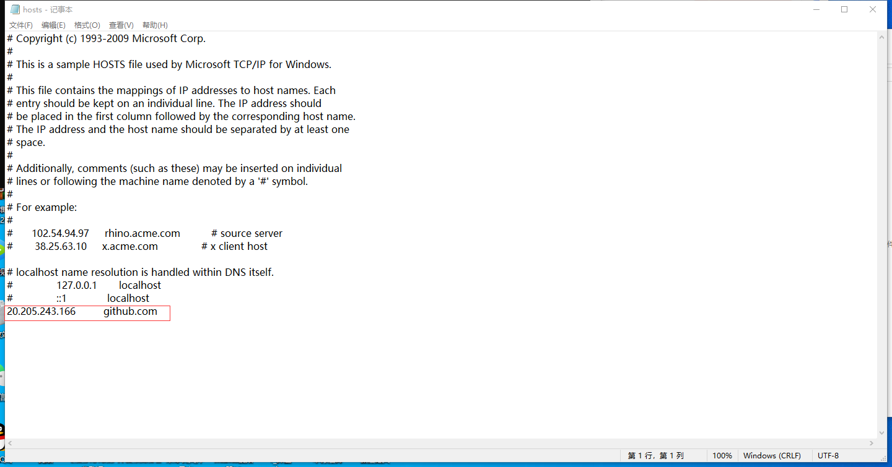
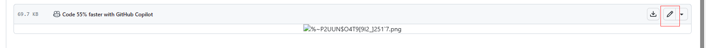

#gihub的使用
###1.github网站登不上去解决方式
在我们尝试访问国内的github网站时，常常会遇到这样的问题：

1. win+R,输入cmd，打开命令提示符，使用ping命令
```
ping github.com
```
得到ip地址
2. 打开电脑文件
```
C:\Windows\System32\drivers\etc下的hosts文件
```
3. 在hosts文件的最后一刚加入刚才复制的ip，并保存（会遇到说权限不够，要换到另一个位置的文档保存，没有关系，直接点就好）

4. 在命令提示符中，使用如下命令：
```dotnetcli
ipconfig/flushdns
```
即可
###2.github加速
针对国内github访问过慢的问题，我使用了Microsoft Edge的插件，篡改猴，运行github加速的相关脚本


###3.注册账号
[github网址:https://github.com/](https://github.com/)
1. 先通过上述网址登陆github网站
2. 然后会弹出登录页面
3. 这时候，如果已经注册过了账号，那就直接点击sign in(登录)
4. 若还未注册账号，则点击sign up(注册)
5. 注册过程中要输入：
+ Username 用户名
+ Email Adress 邮箱（QQ邮箱即可，非常重要，待会儿注册时就是通过邮箱发送验证码，包括邀请共同编写也是通过邮箱）
+ Password 密码 
6. 填写完后，将发送到邮箱的验证码输入即可，注册完毕
###4.基础概念
1. Repository（仓库）：
   简称 Repo，可以理解为“仓库”，我们的项目代码就存放在仓库之中。也就是说，如果我们想要建立项目，就得先建立仓库；有多个开源项目，就建立多个仓库。
2. Star(收藏)：
   可以理解为“点赞”，当我们感觉某一个项目做的比较好之后，就可以为这个项目点赞，而且我们点赞过的项目，都会保存到我们的 Star 之中，方便我们随时查看。在 GitHub 之中，如果一个项目的点星数能够超百，那么说明这个项目已经很不错了。
3. Fork（复制克隆项目）：
   可以理解为“拉分支”，如果我们对某一个项目比较感兴趣，并且想在此基础之上开发新的功能，这时我们就可以 Fork 这个项目，这表示复制一个完成相同的项目到我们的 GitHub 账号之中，而且“独立”于原项目。之后，我们就可以在自己复制的项目中进行开发了。
   如下：
   
4. Pull Request（发起请求）：
   可以理解为“提交请求”，此功能是建立在 Fork 之上的，如果我们 Fork 了一个项目，对其进行了修改，而且感觉修改的还不错，我们就可以对原项目的拥有者提出一个 Pull 请求，等其对我们的请求审核，并且通过审核之后，就可以把我们修改过的内容合并到原项目之中，这时我们就成了该项目的贡献者。
5. Watch（关注）：
   可以理解为“观察”，如果我们 Watch 了一个项目，之后，如果这个项目有了任何更新，我们都会在第一时候收到该项目的更新通知，如果设置了邮件还会邮件通知。
6. Issues（问题；事务卡片）：
   可以理解为“问题”，举一个简单的例子，如果我们开源一个项目，如果别人看了我们的项目，并且发现了 bug，或者感觉那个地方有待改进，他就可以给我们提出 Issue，等我们把 Issues 解决之后，就可以把这些 Issues 关闭；反之，我们也可以给他人提出 Issue。
7. Push（推送）：
   可以理解为“推送”，当你在本地进行修改后，将修改同步到你的 Github 上的仓库中。
8. Merge（合并）：
   可以理解为“合并”，如果别人 Fork 了我们的项目，对其进行了修改，并且提出了 Pull 请求，这时我们就可以对这个 Pull 请求进行审核。如果这个 Pull 请求的内容满足我们的要求，并且跟我们原有的项目没有冲突的话，就可以将其合并到我们的项目之中。当然，是否进行合并，由我们决定。
9. Gist：
    如果我们没有项目可以开源或者只是单纯的想分享一些代码片段的话，我们就可以选择 Gist。如果不翻墙的话，Gist 并不好用。
10. Clone：
    git clone xx 是比较熟悉的操作,它类似于 Download 功能，可以理解为将云端代码下载到我们自己电脑的本地。
    正常的话需要我们本机安装了 git，然后使用 git clone [仓库地址] 即可将制定仓库地址代码下载到我们本机。
###5.三大主页
1. github主页
8Y.png>)
2. 仓库主页
   
3. 个人主页
   
###6.创建仓库
1. 首先，看到这个位置
   
2. Repository name 是仓库名
3. Public 是公共的，所有人都可以看到这个仓库，免费
4. Private 是私人的，付费
5. Readme 是用来描述该项目的文件
6. Create a new repository 创建新的仓库
7. Invite collaborators 邀请协作者，可以邀请人来共同编写项目
   
8. 用户名/仓库名
   
###7.创建文件
1. creating a new file 创建新的文件
   
2. "creating a new file" 点进去之后，界面是这个样子的
   NL6DK~V.png>)
3. "name your file..."这个位置用来填写文件名，形式为“名称.格式“
4. Cancel changes 取消，意思是取消文件的创建
5. Commit changes 提交文件
6. Edit 编辑
7. Preview 渲染，我们可以从中看到我们所写的文件的展示效果
###8.提交现有文件

1. uploading an existing file 上传现有文件
2. 点击进入
   %MIF.png>)
3. choose your files 选择已有本地文件上传
4. Commit changes 的第一行是对描述的总结（标题）
5. 下面的空格是对文件内容的具体描述
###9.提交后的效果

1. 这一栏是文件名
   )X7B~FO.png>)
2. 这一栏是对文件的描述的名称，点击进去可以看到具体的描述
   
3. 点击这里Add file 可以选择创建新文件或者下载文件
   
4. 点击这里的code，点击Download ZIP,可以下载整个文件夹
   L~CU$@[6RY2.png>)
5. 这里可以修改文件
   
#git
###1.git的安装
[git安装网址：https://git-scm.com/download/win](https://git-scm.com/download/win)
具体安装流程见：
[git安装详细流程：https://blog.csdn.net/mukes/article/details/115693833](https://blog.csdn.net/mukes/article/details/115693833)
###2.git的工作区域
~XEU2B$7A.png>)
###3.向仓库中添加文件的流程

###3.git基础设置
1. 设置用户名
   ```dotnetcli
   git config --global user.name '用户名'
   ```
2. 设置用户名邮箱
   ```dotnetcli
   git config --global user.email '用户名邮箱'
   ```
3. 查看设置
   ```dotnetcli
   git config --list
   ```
###4.初始化一个新的git仓库
1. 创建文件夹
   ```dotnetcli
   mkdir 文件夹名
   ```
2. 切换到该文件夹
   ```dotnetcli
   cd 文件夹名
   ```
3. 创建git仓库
   ```dotnetcli
   git
   ```
4. 得到结果
   
5. 显示隐藏文件的步骤
   0MQBR914.png)
###5.将文件发送到git仓库
1. 创建文件
   ```dotnetcli
   touch 文件名
   ```
2. 添加到暂存区
   ```dotnetcli
   git add 文件名
   ```
3. 提交
   ```dotnetcli
   git commit -m '描述'
   ```
注：碰到这个错误的原因是：


###6.修改文件
1. 进入命令行模式，修改文件
   ```dotnetcli
   vi 文件名
   ```
###7.删除文件
1. 删除文件
   ```dotnetcli
   rm 文件名
   ```
2. 从git中删除文件
   ```dotnetcli
   git rm 文件名
   ```
###8.将本地仓库同步到git远程仓库中
```dotnetcli
git push
```
###9.git克隆操作
将远程仓库（github对应项目）复制到本地
```dotnetcli
git clone 仓库地址
```
注：仓库地址
D90.png>)
X@`6J4`R6502UN.png>)